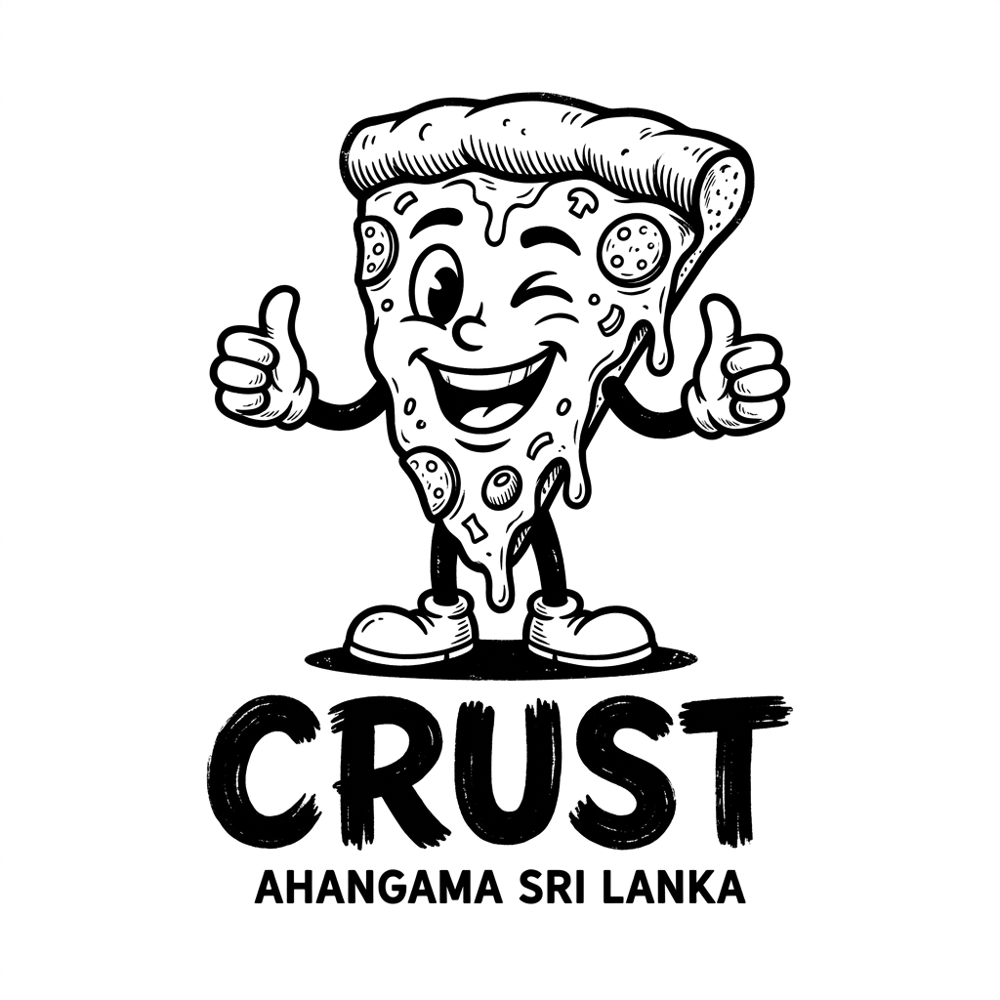

<div align="center">



# 🍕 CRUST AHANGAMA

### *Eat. Drink. Play. Repeat.*

**A modern restaurant, cocktail bar, billiards venue & lifestyle brand**  
📍 Ahangama, Sri Lanka &nbsp;|&nbsp; 🕐 Open Daily 11:00 – 01:00

[](https://www.instagram.com/crust_ahangama)
[](https://www.facebook.com/share/18QSpJUFrv/)
[](https://www.tiktok.com/@crustahangama)

</div>

---

## 🌊 About The Project

**Crust Ahangama** is the official website for Crust — a one-of-a-kind coastal venue nestled in the surf town of Ahangama, Sri Lanka. The site showcases everything Crust has to offer: wood-fired food, crafted cocktails, billiards, live events, a lifestyle shop, and more.

> *"Crust started as a wood-fired oven and a folding table. It grew into a bar, a pool hall, a stage and a shop — because Ahangama asked for all of it."*

---

## 🗂️ Pages & Features

| Page | Description |
|------|-------------|
| 🏠 **Home** (`index.html`) | Hero section, highlights, featured menu items & events |
| 🍽️ **Menu** (`menu.html`) | Full food menu with wood-fired specials |
| 🍹 **Cocktails** (`cocktails.html`) | Cocktail bar menu featuring Ceylon arrack |
| 🎱 **Billiards** (`billiards.html`) | Pool table booking & info |
| 🎉 **Events** (`events.html`) | Upcoming events — DJ nights, Electric Sands & more |
| 🛍️ **Shop** (`shop.html`) | Crust lifestyle merchandise store |
| 🖼️ **Gallery** (`gallery.html`) | Photo gallery of the venue & vibes |
| ℹ️ **About** (`about.html`) | The Crust story, values & community |
| 📞 **Contact** (`contact.html`) | Contact form, location map & details |
| 📅 **Reservations** (`reservations.html`) | Table reservation booking system |
| 🛒 **Cart** (`cart.html`) | Shopping cart for merchandise |
| ✅ **Checkout** (`checkout.html`) | Checkout flow for orders |

---

## 🛠️ Tech Stack

| Technology | Usage |
|------------|-------|
|  | Page structure & semantic markup |
|  | Styling, animations & responsive design |
|  | Interactivity, mobile nav & UI logic |

**Key design features:**
- 🎨 Dark-mode aesthetic with grain texture overlay
- ✨ Scroll-triggered reveal animations
- 📱 Fully responsive — mobile & desktop
- 🔤 Custom typography system
- 🖼️ Optimized image loading (`lazy` + `eager`)
- 🧭 Mobile hamburger drawer navigation

---

## 📁 Project Structure

```
Crust-Ahangama/
│
├── 📄 index.html               # Homepage
├── 📄 about.html               # About page
├── 📄 menu.html                # Food menu
├── 📄 cocktails.html           # Cocktail bar
├── 📄 billiards.html           # Billiards page
├── 📄 events.html              # Events listing
├── 📄 shop.html                # Merchandise shop
├── 📄 gallery.html             # Photo gallery
├── 📄 contact.html             # Contact page
├── 📄 reservations.html        # Table reservations
├── 📄 cart.html                # Shopping cart
├── 📄 checkout.html            # Checkout
├── 📄 product.html             # Product detail
├── 📄 order-confirmation.html  # Order success page
│
└── 📁 assets/
    ├── 🎨 style.css            # Main stylesheet
    ├── 🎨 animations.css       # Animation styles
    ├── ⚙️  main.js              # JavaScript logic
    └── 🖼️  [images]             # All photos & media
```

---

## 🚀 Getting Started

No build tools required — this is a pure HTML/CSS/JS project.

### Run Locally

```bash
# Clone the repository
git clone https://github.com/Himal-Hansaka99/Crust-Ahangama.git

# Navigate to the project
cd Crust-Ahangama

# Open in browser (or use VS Code Live Server)
open index.html
```

### Deploy to GitHub Pages

1. Go to your repository **Settings**
2. Click **Pages** in the left sidebar
3. Under **Source**, select `Deploy from a branch`
4. Choose `main` branch → `/ (root)` → **Save**
5. Your site will be live at:
   `https://himal-hansaka99.github.io/Crust-Ahangama/`

---

## 📞 Contact & Venue

| | Details |
|--|---------|
| 📍 **Location** | Ahangama, Sri Lanka |
| 🕐 **Hours** | Open Daily — 11:00 to 01:00 |
| 📱 **Phone** | [+94 770 747 446](tel:+94770747446) |
| 📧 **Email** | [crustahangama@gmail.com](mailto:crustahangama@gmail.com) |
| 📸 **Instagram** | [@crust_ahangama](https://www.instagram.com/crust_ahangama) |

---

## 📄 License

This project is proprietary. All content, images, and branding belong to **Crust Ahangama**.  
© 2026 Crust Ahangama. All rights reserved.

---

<div align="center">

**Made with 🔥 & ❤️ in Ahangama, Sri Lanka**

*Eat. Drink. Play. Repeat.*

</div>